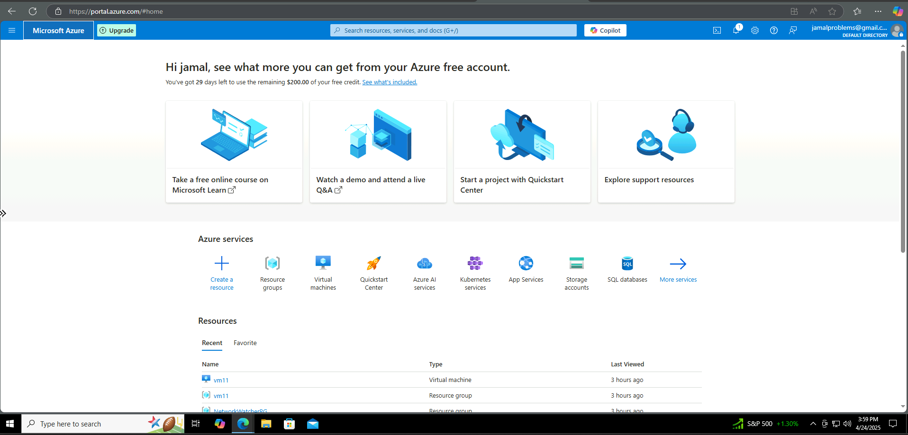
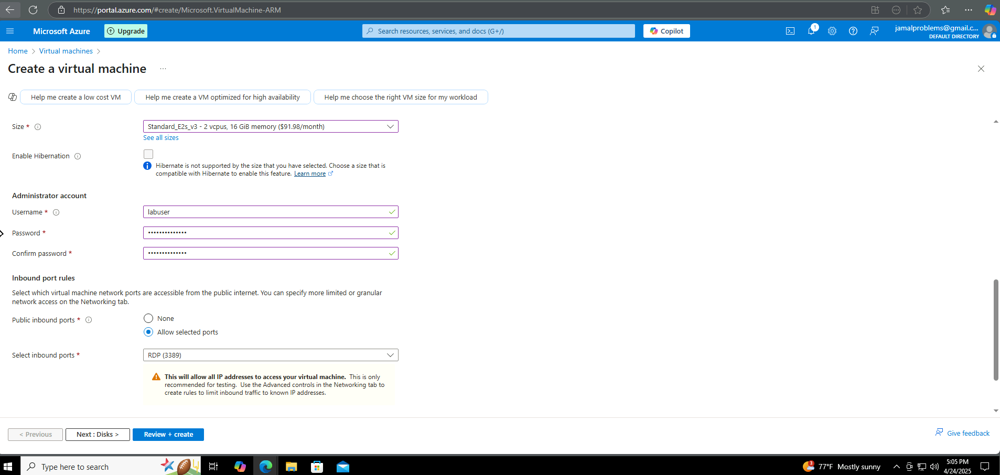
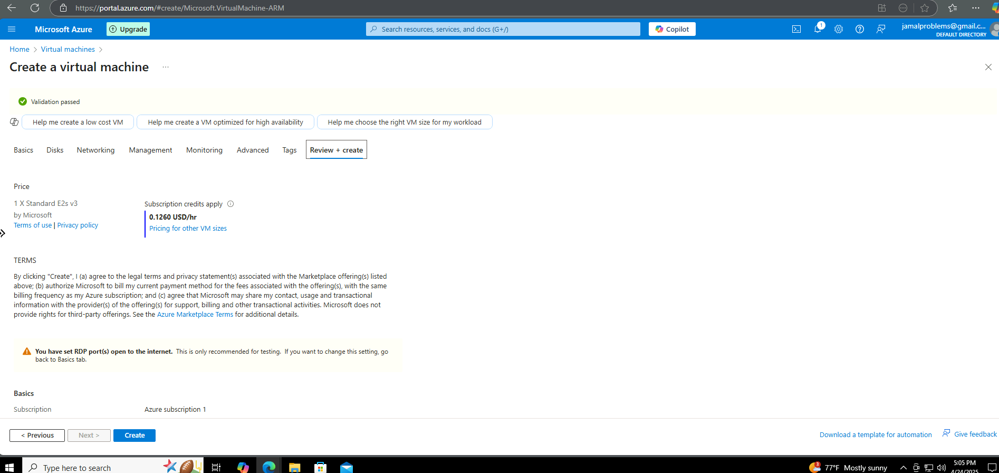
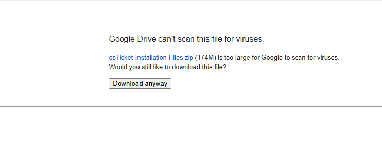

# osTicket-prereqs
This tutorial outlines the prerequisites and installation of the open-source help desk ticketing system osTicket. 

<h2>Video Demonstration</h2>

- ### [YouTube: How To Install osTicket with Prerequisites](https://www.youtube.com)

<h2>Environments and Technologies Used</h2>

- Microsoft Azure (Virtual Machines/Compute)
- Remote Desktop
- Internet Information Services (IIS)

<h2>Operating Systems Used </h2>

- Windows 10</b> (21H2)

<h2>List of Prerequisites</h2>

- [OsTicket Download](https://drive.google.com/uc?export=download&id=1b3RBkXTLNGXbibeMuAynkfzdBC1NnqaD)
- [Pre-Installation Checklist](https://docs.google.com/document/d/1DyjX8LeVU98LjhXO2t2K2F0aHywI2N9GD57T3taO5qo/edit?tab=t.0)

<h2>Installation Steps</h2>

### **Step 1 - Create an Azure Account**

To follow along, you’ll need an Azure account. If you don’t already have one:

Go to https://portal.azure.com

Sign up or log in

Azure offers a free tier with credits for new users

Once you’re logged into the Azure Portal, you're ready to begin the Lab.

---

### **Step 2: Explore the Azure Portal**

Once you log into the Azure Portal, you’ll land on the dashboard where you can manage all your cloud resources.

From here, you can:

✅ Create new resources (like virtual machines or storage)

📁 Organize your environment using Resource Groups

🧠 Try out Azure AI, App Services, Kubernetes, and more

💬 Access tutorials and support through the Quickstart Center

📝 Note: You’ll see a message about your remaining free credit and options to upgrade when you’re ready.

---

### **Step 3: Create a Virtual Machine in Azure**

We’ll now set up the virtual machine that will host our osTicket system using the Azure portal.

#### 🔹 1. Start VM Creation

From the Azure portal dashboard, click:

**Create a resource → Compute → Virtual Machine**

#### 🔹 2. Fill Out the Basics Tab

On the **Basics** tab, enter your core VM details.

**Example values:**

- **Resource group:** `osticket-Lab`  
- **Virtual machine name:** `osticket-vm`  
- **Region:** `East US` (or your closest region)  
- **Image:** `Windows 10 Pro`  
- **Size:** `Standard_E2s_v3`  
- **Authentication type:** Password  
- **Username/Password:** Create secure login credentials  
- **Inbound ports:** Allow **RDP (3389)**

‼️Make sure you check the box under **Licensing**‼️
> ⚠️ *Save your username and password — you’ll need them to access the VM later.*

 

#### 🔹 3. Leave Default Settings for Remaining Tabs

You can leave all the following tabs at their default settings:

- **Disks**
- **Networking**
- **Management**
- **Advanced**
- **Tags**

No additional configuration is needed for this tutorial.

#### 🔹 4. Review and Create the VM

Once you complete the Basics tab and skip the rest, you'll land on the **Review + Create** page.

If everything looks correct, click **Create** to deploy the virtual machine.

> 🛠️ *Deployment may take a couple of minutes. Once it’s complete, you’ll see a confirmation and a link to view your resource.*

---

### **Step 4: Connect to the Virtual Machine Using RDP**

Now that your VM is deployed, you can connect to it using Remote Desktop Protocol (RDP).

#### 🔹 1. Get the Public IP Address

After deployment, you’ll be taken to the **VM Overview page**. Here, you’ll see your VM’s **Public IP address** listed on the right-hand side.

Copy this IP address — you’ll use it to connect to the VM.

> 💡 *You can also find this later by going to: Azure Portal → Virtual Machines → Select your VM → Overview tab.*

#### 🔹 2. Open Remote Desktop on Your Computer

On your local machine:

- Open the **Remote Desktop Connection** app (on Windows, search for "RDP" or "Remote Desktop")
- Paste the **public IP address** into the **Computer** field
- Click **Connect**

#### 🔹 3. Log Into the VM

When prompted:

- Enter the **username and password** you created during the VM setup
- You may see a warning about certificate trust — click **Yes** to proceed

You’ll now be connected to your virtual machine’s desktop environment.

> ✅ *From here, we will begin installing software, setting up your ticketing system, or making system changes as needed.*

---

### **Step 5: Download and Prepare the osTicket Installation Files**

Inside your VM, download the osTicket installation package and extract it to the desktop.

#### 🔹 1. Download the ZIP

Click the link below to download the installation files:

👉 [osTicket Download](https://drive.google.com/uc?export=download&id=1b3RBkXTLNGXbibeMuAynkfzdBC1NnqaD)

- When prompted, click **Download**
- If your browser flags the file, choose **Download Anyway**

  

> 💡 This ZIP file includes osTicket and some required dependencies already packaged.

#### 🔹 2. Unzip to the Desktop

- Right-click the downloaded file → **Extract All**
- Choose **Desktop** as the destination
- You should now see a folder named: osTicket-Installation-Files

- 
Located here:
C:\Users<YourUser>\Desktop\osTicket-Installation-Files

> ✅ We’ll use the files in this folder to install osTicket and its required components in the upcoming steps.

---

### **Step 6: Install and Enable IIS with CGI Support**

To run osTicket on Windows, we need to install **IIS (Internet Information Services)** and enable **CGI** to allow PHP to function properly.

This is done through Windows Features in the Control Panel.

#### 🔹 1. Open Windows Features

Inside your VM:

- Open the **Control Panel**
- Go to **Programs**
- Click **“Turn Windows features on or off”**

> 💡 You can also search “Windows Features” in the Start menu to access it directly.

#### 🔹 2. Enable IIS and CGI

In the **Windows Features** window:

- Scroll down and check **Internet Information Services**
- Expand it by clicking the `+` symbol
- Then expand **World Wide Web Services**
- Expand **Application Development Features**
- Check the box for **CGI**

Click **OK** to install IIS and CGI. Windows will take a few minutes to apply the changes.

---

### **Step 7: Install Required IIS Extensions and Set Up PHP Directory**

Now that IIS and CGI are enabled, it’s time to install a few important components from the `osTicket-Installation-Files` folder to make IIS compatible with PHP and URL rewriting — both necessary for osTicket to run.

#### 🔹 1. Open the Installation Folder

Navigate to the Desktop and open the folder named: `osTicket-Installation-Files`

#### 🔹 2. Install PHP Manager for IIS

- Double-click **`PHPManagerForIIS_V1.5.0.msi`**
- Go through the installer and complete the setup

> 🛠️ This tool allows you to easily manage and configure PHP settings within IIS.

#### 🔹 3. Install URL Rewrite Module

- Double-click **`rewrite_amd64_en-US.msi`**
- Follow the prompts to complete the installation

> 🔁 This module is required by osTicket to support user-friendly URLs and redirects.

#### 🔹 4. Create the PHP Directory

Now create a directory that will hold your PHP files:

1. Open **File Explorer**
2. Navigate to the **C:\** drive
3. Right-click inside the window → **New > Folder**
4. Name the folder: `PHP`

> 📁 You should now have an empty folder at `C:\PHP` ready for the next step, where we’ll extract and configure PHP.

   

#### 🔹 5. Extract PHP, Install VC++ Runtime, and MySQL

Next, extract and install the necessary components for osTicket to run properly.

##### ✅ Extract PHP

- Inside the installation folder, find:`php-7.3.8-nts-Win32-VC15-x86.zip`

- Right-click → **Extract All**
- Set the destination to: `C:\PHP`

  
> ✅ When done, your `C:\PHP` folder should now contain the PHP files needed for IIS.

##### ✅ Install Visual C++ Redistributable

- Run **`VC_redist.x86.exe`**
- Accept the license terms and complete the setup

> 🧱 Required for PHP 7.3.8 to function correctly on Windows

##### ✅ Install MySQL 5.5.62

- Run **`mysql-5.5.62-win32.msi`**
- Choose **Typical Setup**
- After install, launch the **MySQL Instance Configuration Wizard**

In the wizard:

- Choose **Standard Configuration**
- Set login credentials to:
Username: `root`
Password: `root`

> 🔐 Remember these credentials — they’ll be used to connect osTicket to the database later.

At this point, your VM is ready with PHP, MySQL, and all required IIS modules installed. You’re now set to configure IIS and link it with PHP.

---

### **Step 8: Register PHP with IIS Using PHP Manager**

Now that PHP has been extracted and installed, we need to register it within IIS using PHP Manager so the server knows how to handle `.php` files.

#### 🔹 1. Open IIS as Administrator

- Click **Start**, search for **IIS** or **Internet Information Services (IIS) Manager**
- Right-click it and select **Run as Administrator**

> ⚠️ PHP Manager may not show or work properly unless IIS is opened with admin rights.

#### 🔹 2. Register PHP with PHP Manager

- In IIS, click your **server name** in the left panel (not a specific site)
- Double-click **PHP Manager**

- Click **“Register new PHP version”**
- Browse to: **C:\PHP\php-cgi.exe**

- Click **OK** to register PHP

You should now see PHP listed as registered in PHP Manager.

> ✅ PHP is now linked to IIS and ready to process `.php` files.

#### 🔹 3. Reload IIS

To apply the changes:

- In IIS, click your **server name** again
- In the right panel (Actions), click **Stop**
- Then click **Start**
 

> 🔄 This restarts the IIS service with PHP enabled and ready to go.

